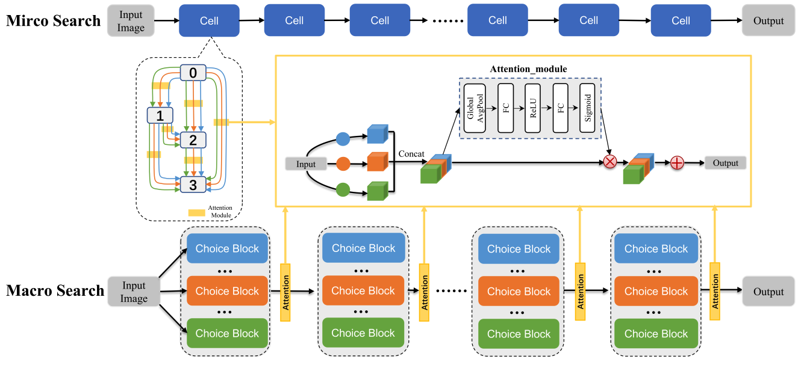

# AGNAS: Attention-Guided Micro- and Macro-Architecture Search (ICML 2022)


This is an official pytorch implementation for ([AGNAS: Attention-Guided Micro- and Macro-Architecture Search](https://proceedings.mlr.press/v162/sun22a/sun22a.pdf)) by Zihao Sun, and et. al.



## Requirements
* Python 3.7.10
* PyTorch >= 1.1.0


## Dataset
CIFAR-10 can be automatically downloaded using this code by torchvision, and place them in the folder ./dataset/cifar10

ImageNet needs to be manually downloaded and following the instructions [here](https://github.com/pytorch/examples/tree/master/imagenet).

## Usage

### AGNAS in Darts_Search_Space

> To evaluate the AGNAS searched model on CIFAR-10

Pre-trained checkpoints are released in [google drive](https://drive.google.com/drive/folders/1uuqN72IkjR7Is9nTWXONsID0pju-U_bk). Download and place them in the ./Darts_Search_Space/eval_retrained_model, and run
```shell
cd Darts_Search_Space
python test.py
```

> To search AGNAS model on CIFAR-10, run:
```shell
cd Darts_Search_Space
python train_search.py
```

> To retrain AGNAS searched model on CIFAR-10, run:
```shell
cd Darts_Search_Space
python train.py
```


### AGNAS in ProxylessNAS_Search_Space

> To evaluate the AGNAS searched model on ImageNet

Pre-trained checkpoints are released in [google drive](https://drive.google.com/drive/folders/12o1ywmO0p61y8L7nCkeYfV-8aurisA4p). Download and place them in the ./ProxylessNAS_Search_Space/retrain_architecture/eval_retrained_model, and run
```shell
cd ProxylessNAS_Search_Space/retrain_architecture
python valid.py
```
> To search AGNAS model on ImageNet, run:
```shell
cd ProxylessNAS_Search_Space/attention_search
bash run_train.sh
```

> To retrain AGNAS model on ImageNet, run:
```shell
cd ProxylessNAS_Search_Space/retrain_architecture
bash run_retrain.sh
```


## Citation
Please cite our paper if you find anything helpful.
```
@inproceedings{sun2022agnas,
  title={AGNAS: Attention-Guided Micro and Macro-Architecture Search},
  author={Sun, Zihao and Hu, Yu and Lu, Shun and Yang, Longxing and Mei, Jilin and Han, Yinhe and Li, Xiaowei},
  booktitle={International Conference on Machine Learning},
  pages={20777--20789},
  year={2022},
  organization={PMLR}
}
```
